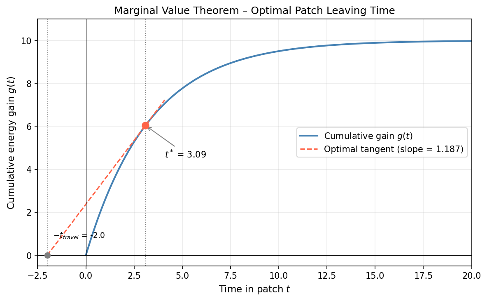
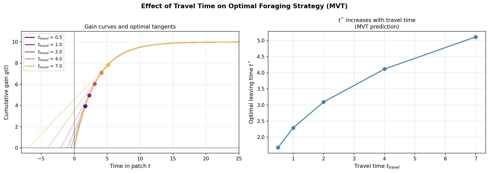
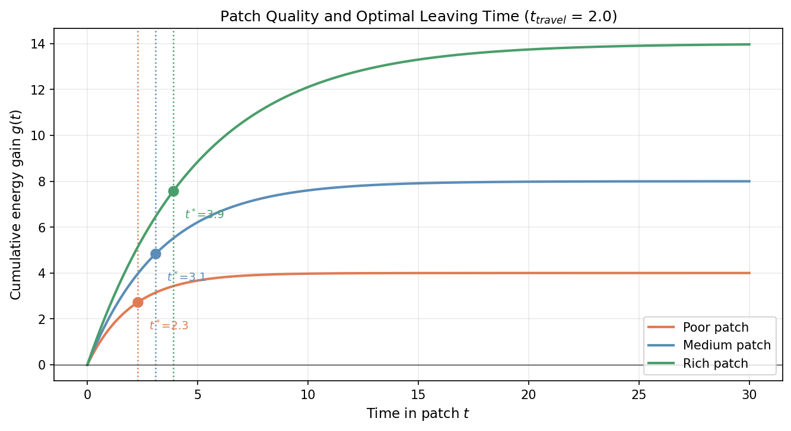
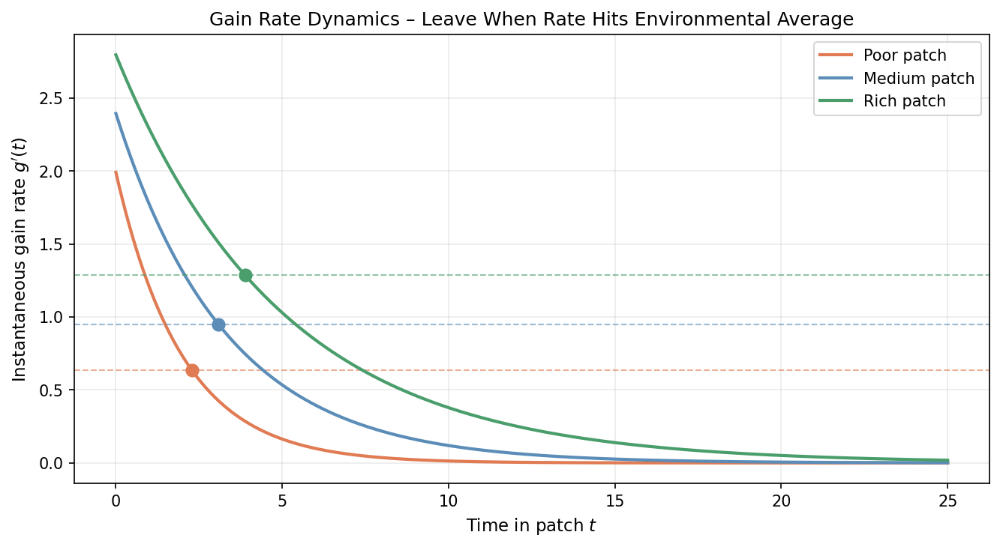

# Foraging Behavior Simulation – Marginal Value Theorem (MVT)

A computational implementation of the **Marginal Value Theorem** (Charnov, 1976), one of the foundational models in behavioral ecology and computational decision-making research.

---

## Background

The MVT addresses a classic optimization problem: given that food resources in a patch deplete over time, when should a forager leave to maximize its long-term energy intake rate?

The answer: **leave when the instantaneous gain rate drops to the average rate achievable across the environment** (including travel time between patches).

This simple rule has been shown to predict foraging behavior across a wide range of species — from bees and birds to primates and humans — and provides a normative benchmark for studying how real agents deviate from optimality.

---

## Mathematical Model

**Gain function** (diminishing returns in a patch):

$$g(t) = G_{\max}\left(1 - e^{-\lambda t}\right)$$

**Optimal leaving time** $t^*$ satisfies the marginal condition:

$$g'(t^*) = \frac{g(t^*)}{t^* + t_{\text{travel}}}$$

This is equivalent to finding the point on the gain curve where the tangent line from $-t_{\text{travel}}$ on the time axis is tangent to the curve — the classic geometric construction of the MVT.

---

## Simulations

### 1. Classic MVT diagram
The gain curve with the optimal tangent line. The tangent point gives $t^*$.



### 2. Effect of travel time
Longer travel time between patches → longer optimal stay in each patch.



### 3. Patch quality comparison
Richer patches with slower depletion rates warrant longer foraging times.



### 4. Gain rate dynamics
The forager leaves when instantaneous gain rate crosses the environmental average (dashed lines).



---

## Usage

```bash
pip install numpy matplotlib scipy
python mvt.py
```

---

## Repository Structure

```
foraging-mvt-simulation/
├── mvt.py              # Main simulation and visualization
├── README.md           # This file
└── requirements.txt
```

---

## References

- Charnov, E. L. (1976). Optimal foraging: the marginal value theorem. *Theoretical Population Biology*, 9(2), 129–136.
- Stephens, D. W., & Krebs, J. R. (1986). *Foraging Theory*. Princeton University Press.
- Pyke, G. H. (1984). Optimal foraging theory: a critical review. *Annual Review of Ecology and Systematics*, 15, 523–575.
